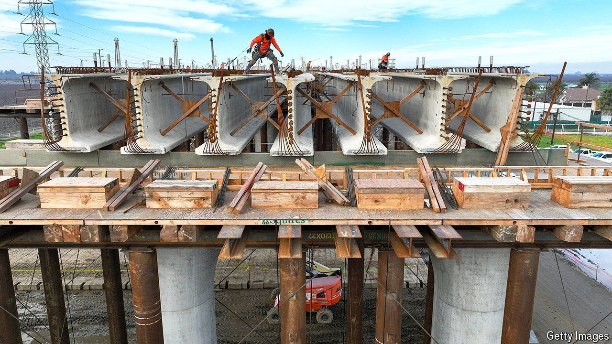

###### High-speed rail

# The world’s slowest bullet train trundles ahead in California 

##### An extra $3bn of federal funding is nice; as for the other $80bn, dream on 

 

> May 16th 2024 

The Central Valley of California is a vast expanse of flat farmland, far from the bustling cities on the state’s coast. How surprising, then, to drive along its straight highways and suddenly see rising on concrete pillars one of America’s most ambitious infrastructure projects in decades: a bullet-train line planned to run between Los Angeles and San Francisco.

The surprise comes not just from its incongruous setting, among almond and plum orchards, but also from the fact that progress in construction is actually visible. The high-speed railway is better known for its ultra-low speed of development. California began planning it three decades ago. In 2008, when the state’s voters approved nearly $10bn in bonds for the train, it was thought that the total cost would run to $33bn and that it would be done by 2020. Now it expects to spend up to $35bn plus another decade just to finish the middle section—171 miles from Bakersfield to Merced, the easiest terrain for building.

