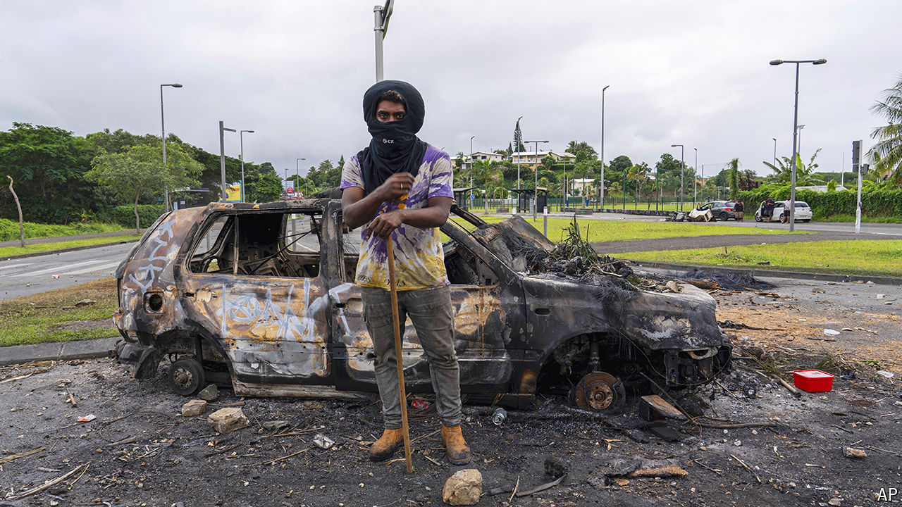

###### New Caledonia, Old Tensions

# Geopolitics helps reignite New Caledonia’s anti-colonial unrest 

##### Emmanuel Macron makes an emergency dash to the troubled Pacific island 

 

> May 23rd 2024 

THE RECENT sharpening of international rivalries has an impact all over the world—even in far-flung parts of the Pacific. It now seems to have encouraged outsiders to pick at old wounds in New Caledonia. As the French territory was swept by rioting this month, leaving six dead including two policemen, dozens of X and Facebook posts with the hashtag #EndFrenchColonialism alleged: “French police are murderers in New Caledonia”. When Gérald Darmanin, France’s interior minister, first denounced meddling by Azerbaijan, it appeared far-fetched. Then Viginum, an official body in Paris that monitors social-media disinformation, confirmed it had traced the posts to Azerbaijan, a regime close to Russia and angry at French support for neighbouring Armenia. The French pointed to interference not just from Baku but from Moscow and Beijing. 

It is a measure of how seriously France takes the troubled nickel-rich islands, and any hint of meddling in its affairs, that Emmanuel Macron, the French president, on May 21st unexpectedly cleared his diary and set off from Paris for Nouméa, the capital. The territory is central to France’s ambition to act as an Indo-Pacific power, not least since the  deal in 2021 between Australia, America and Britain scuppered a  it had signed to supply submarines to Australia. France has been increasingly worried about China’s influence in Pacific countries. In the words of Claude Malhuret, a centrist French senator: “China is waiting for New Caledonia to fall into into its hands like a ripe fruit.” 

