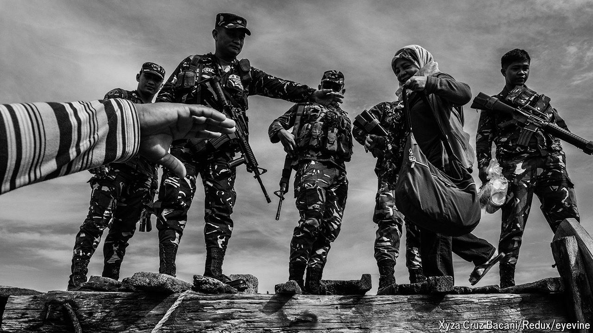

###### Bangsamoro’s moment

# In the Philippines a decades-long conflict nears its endgame 

##### Peace in Mindanao matters for regional security 

 

> May 23rd 2024 

AHOD “AL HAJ MURAD” EBRAHIM spent most of his life waging war against the Philippine government in the jungles of Mindanao, in the country’s south. These days the septuagenarian rebel is behind a desk in Cotabato, capital of the fledgling Bangsamoro Autonomous Region in Muslim Mindanao (BARMM). “As revolutionaries we dreamed of having our own government, and now we have it,” he marvels.

The guerrilla war between Muslim separatists and the Philippine government is one of Asia’s most protracted conflicts. Its resolution is entering a final, fraught phase. In 2014 the Philippine government signed a peace agreement with Mr Ebrahim’s  (MILF), then the main rebel group, ending fighting that had killed at least 120,000 people since 1970. The accord mandated the creation of the BARMM as an autonomous region of the Philippines. Its first parliamentary elections are due in 2025. 

