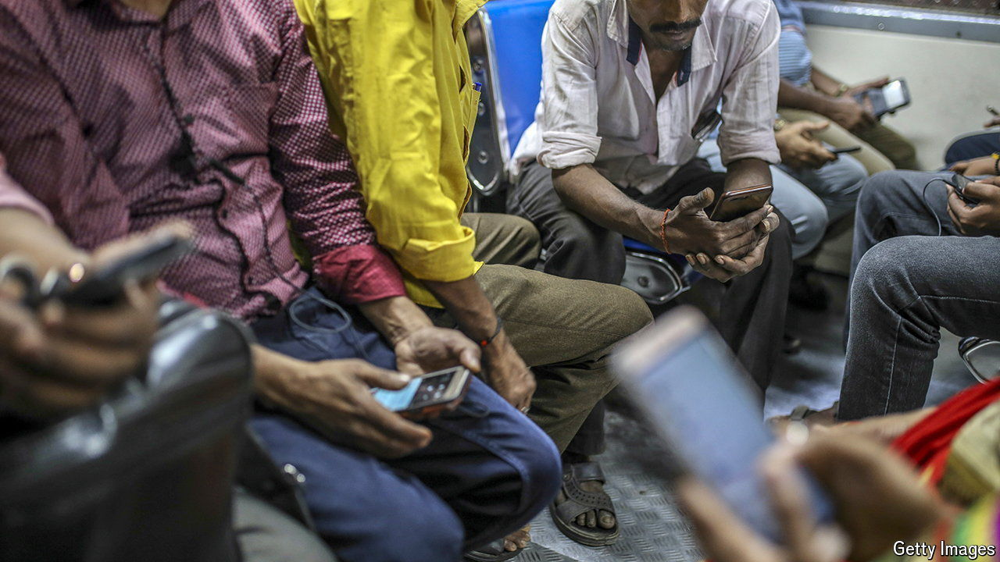

###### An unruly corner

# India’s YouTubers take on Narendra Modi 

##### In one corner of India’s internet, dissent survives. For now 

 

> May 23rd 2024 

“IF IT WEREN’T for YouTube, I would be out of this profession,” confesses Ravish Kumar, a veteran broadcaster and winner of the prestigious Magsaysay award, regarded as Asia’s version of the Nobel prize. Long an anchor at NDTV, one of the few sober news channels in India, Mr Kumar left in late 2022 when it was acquired by , an Indian billionaire known for his close ties to the country’s prime minister, Narendra Modi. These days Mr Kumar is an independent journalist with a channel on YouTube, with over 10m subscribers and 20m views a week. The video-sharing site has become a refuge for independent voices, from sidelined journalists to political satirists.

Take Dhruv Rathee, a 29-year-old YouTuber, who has emerged as a leading figure of online dissent. With around 20m subscribers, his channel is among India’s most popular. A recent video in which he argued that India had slipped into dictatorship was viewed 32m times in just one month. Other seasoned journalists, formerly national-TV anchors, like Punya Prasun Bajpai, Abhisar Sharma and Ajit Anjum, host shows with large audiences. Adding edge on the digital front are satirists such as Neha Singh Rathore, a folk singer, and Kunal Kamra, a comedian. 

