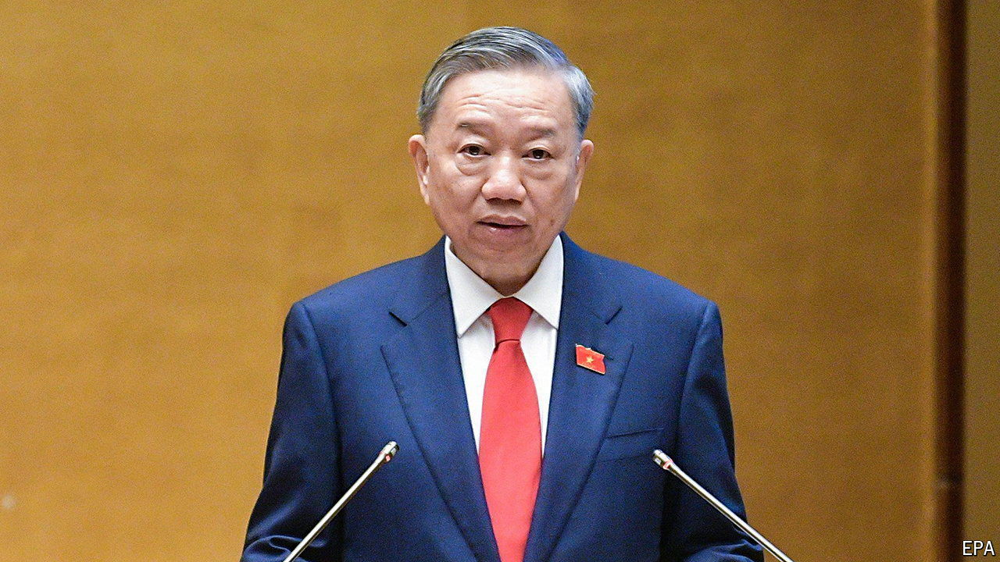

###### All-consuming fires

# Vietnam’s ruling communists rush to fill the country’s top jobs 

##### Amid an anti-graft drive, they will struggle to restore an aura of calm 

 

> May 23rd 2024 

THE MONOLITHIC façade erected by one of the world’s most secretive ruling parties is intended to project awesome power, competence and granite-faced consensus. Yet the cracks in the Vietnamese Communist Party’s front of late have been only too obvious to both ordinary Vietnamese and foreign businesses.

In March the state president,  for “violations” and “shortcomings”—words presumed to refer to corruption. Extraordinarily, Mr Thuong had been in place for little more than a year, after his predecessor took the rap for a massive scam involving covid-19 testing kits. Then in April the chairman of the National Assembly, Vuong Dinh Hue, quit, for (also unexplained) “violations” that supposedly harmed the party, the state and himself. And on May 16th the powerful head of the party’s central secretariat, Truong Thi Mai, the first woman to rise so high, resigned on similar grounds. In short order, then, incumbents of three of the land’s five most powerful posts have been fired. Such turmoil is unprecedented. It is assumed to be related to a fierce battle against graft being waged by the 80-year-old general secretary of the party, . Mr Truong calls this campaign his “blazing furnace”.

