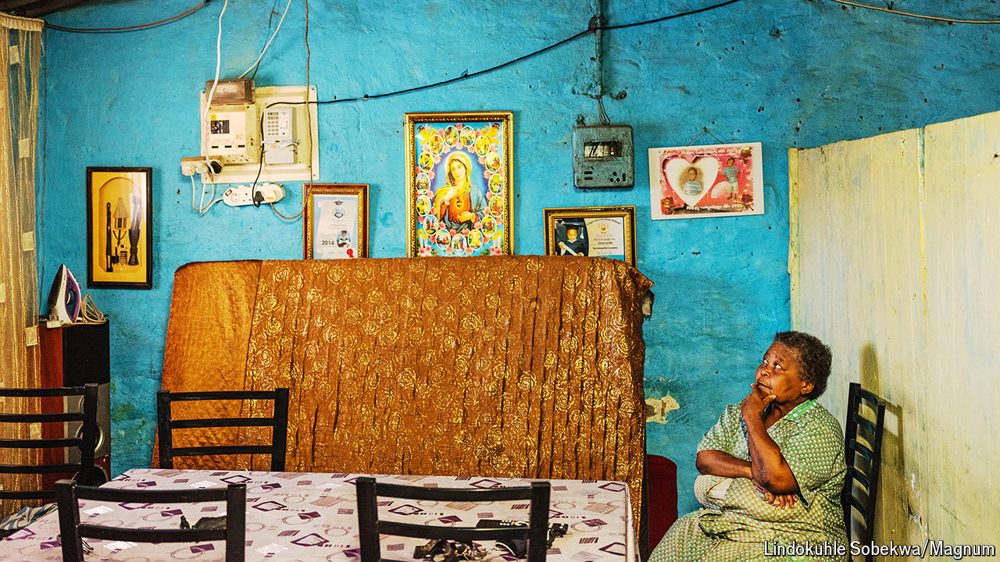

###### Dawdling and decay

# Next week’s election is South Africa’s most important since 1994 

##### It may force the country’s indecisive leader to make a fateful choice 

 

> May 23rd 2024 

Since taking office in 2018, Cyril Ramaphosa has turned indecisiveness into an art form. No matter the problem, South Africa’s president will dither about the solution. Six years after pledging a “new dawn” he has yet to get to grips with the country’s multiple crises, including record unemployment, the highest murder rate in 20 years and widespread corruption.

So it is troubling that Mr Ramaphosa may soon have to make a momentous choice. On May 29th South Africa will hold national and provincial elections.  suggests the ruling African National Congress (ANC) will win its lowest share of the vote ever, probably falling below 50% for the first time. South Africa’s proportional voting system means that it would then need to form a coalition to govern. Potential partners range from thuggish black nationalists to multiracial liberals, making Mr Ramaphosa’s decision a fateful one for South Africa, and this election the most important since 1994, when Nelson Mandela became president. 

