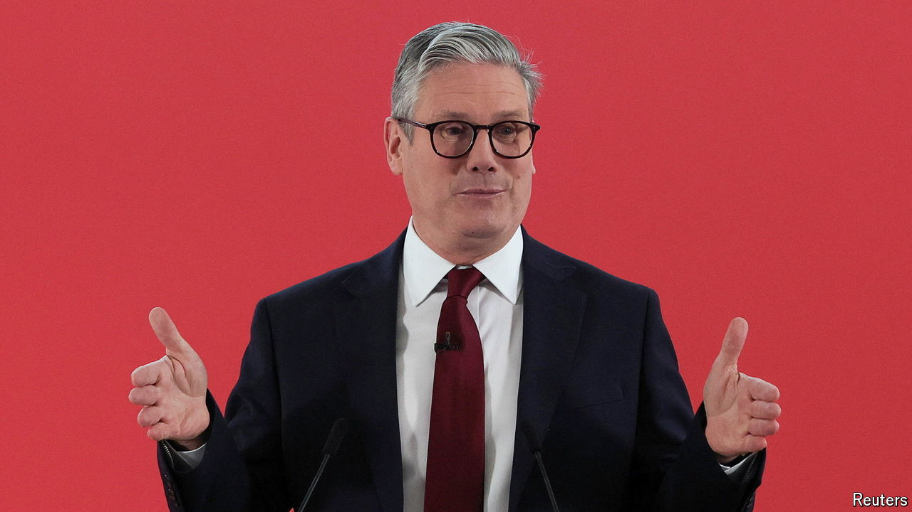

###### Paranoid android

# Could the Labour Party blow its big opportunity? 

##### Sir Keir Starmer’s party is terrified of letting victory slip through its fingers 

 

> May 23rd 2024 

Britain will hold a general election on July 4th. Announcing the news in Downing Street on May 22nd, his expression plaintive and his jacket soaked with rain, Rishi Sunak had the air of a man who knew what the result would be. Since he took office in October 2022, the prime minister has tried anything and everything to reverse the Conservative Party’s ailing poll numbers—diligent promises to reduce inflation and health-care waiting lists; bellicose swagger about deporting migrants; an offer of stability, then change, then stability again. To no avail.

The Labour Party now has an average poll lead of 23 percentage points, a deficit that no governing party has successfully overcome in an election campaign. The central scenario of ’s , which draws from polls and the results in individual constituencies in elections dating back to 1959, is that Labour will win 381 seats to the Tories’ 192 (see chart 1), a thumping majority of 112 MPs. The model gives less than a 1% chance that the Conservatives would win a majority of seats if an election were held tomorrow. A separate analysis by , based on 100,000 responses to surveys conducted by WeThink, a polling firm, shows that  have become less likely to support the Tories than they were at the election in 2019. Polling by Ipsos finds that voters think it is “time for a change” by a margin of 73% to 18%. 

