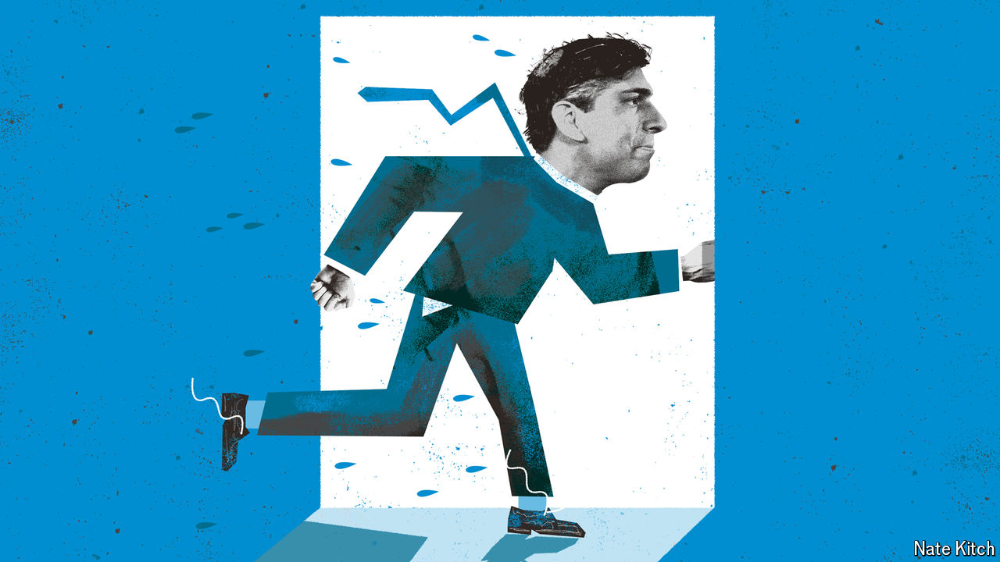

###### Bagehot

# Rishi Sunak’s snap election is odd and illogical—much like him 

##### For a man who says he has a plan, the prime minister acts in an impulsive way 

 

> May 22nd 2024 

Over the patter of the rain and the sound of protesters’ speakers blasting “Things Can Only Get Better”, an anthem of New Labour, it was almost impossible to hear Rishi Sunak outside 10 Downing Street on May 22nd. The words were close to inaudible but the message was clear: the prime minister had spoken to the king, Parliament was to be dissolved and . The decision is impulsive, illogical and entirely in keeping with the manner in which Mr Sunak has governed. 

Calling an election earlier than many had expected has some small merit. The inflation figure for the year to April, released earlier in the day, was slightly higher than expected, at 2.3%. Although Mr Sunak claimed victory (“inflation is back to where it should be”) hopes of early interest-rate cuts by the Bank of England, which would relieve pain for mortgage-holders, had gone. Higher borrowing costs also leave little room for another round of tax cuts in the autumn. The main benefit of delaying, at least in the eyes of the government, had disappeared. So why wait? 

