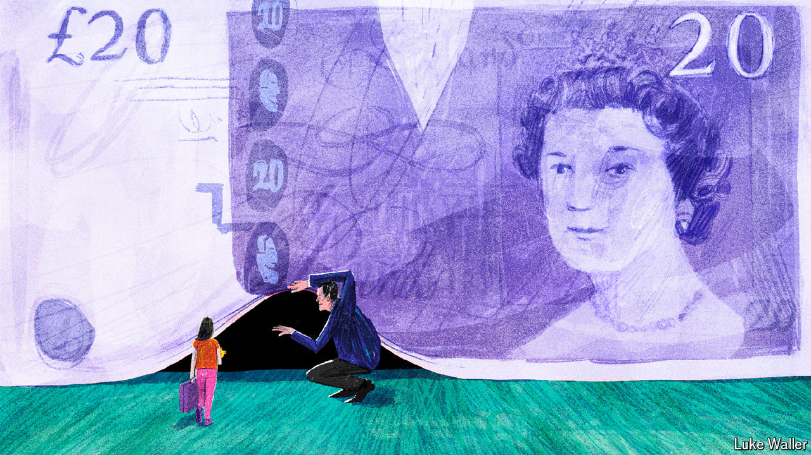

###### A system under strain

# The sorry story of children in care in England 

##### The state is struggling to perform one of its most basic functions 

 

> May 23rd 2024 

Jade barnett learned that she was being moved from foster care into a children’s home a few years ago when she saw her possessions in the back of a taxi. The children’s home turned out to be near Blackpool, in north-west England—330 kilometres from London, where she grew up and where the social workers who were meant to be looking after her were based. She expected to stay in the home for two weeks. It turned into one and a half years.

Some 84,000 children in England are in the care of local authorities because their parents cannot look after them for one reason or another. In an extremely centralised country, it is one of the few important responsibilities that those institutions still have. Every year councils spend more money on the children in their care. Every year the system serves the country’s most vulnerable children less well. 

