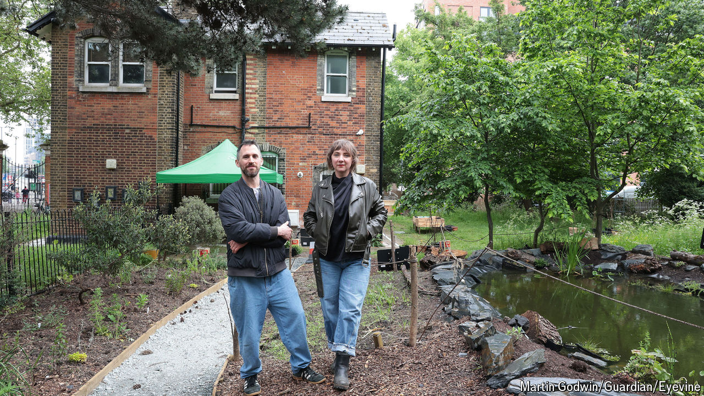

###### A permanent home

# The world’s first museum of homelessness 

##### A new venue in London dedicated to an overlooked group 

 

> May 23rd 2024 

“OH GOD, MATE, it takes me back,” says one actor as she pulls a black plastic bag over her head to demonstrate how she used to wear one as a rain poncho. Another actor points out the weathered duct tape holding together “Fred’s Trolley”, a shopping trolley used during the covid-19 pandemic to serve tens of thousands of hot drinks to homeless people on the street. Both actors used to be homeless. They are performing as part of the opening exhibition at the Museum of Homelessness (MOH), the world’s first of its kind, in north London.

Shelter, a charity, estimates that on any given night 3,000 people in England sleep rough (very many more live in hostels or temporary accommodation). But their experiences have been largely overlooked by cultural bigwigs. In 2014 Jess and Matt Turtle, the museum’s curators, were offered a collection of 7,000 objects from the Simon Community, a homelessness organisation. They have since collected many more items from anonymous donors on the streets. After a decade of operating temporary exhibitions the MoH, which is a charity, signed a ten-year lease on an empty cottage inside Finsbury Park. From May 24th the museum will be open to the public, who will be able to see items from its permanent collection and from a special exhibition called “How to Survive the Apocalypse”.

