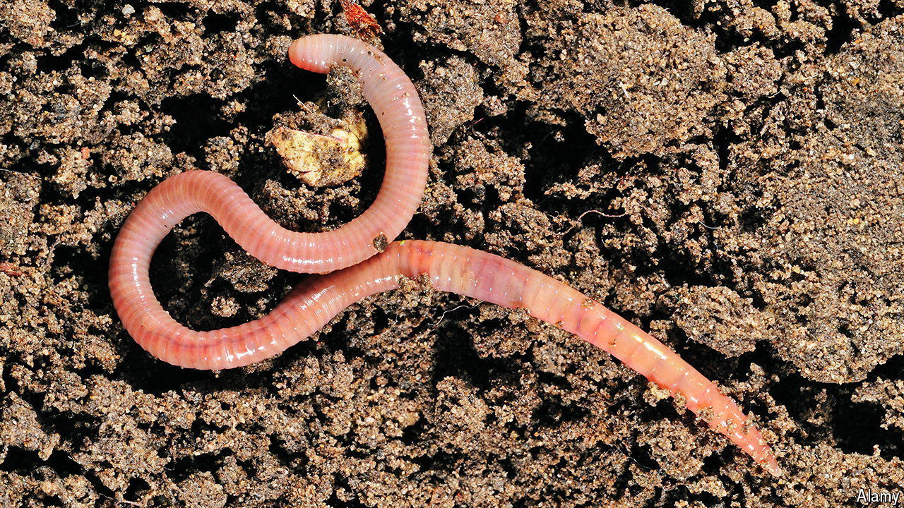

###### Wiggly wormageddon

# What’s behind Britain’s earthworm cataclysm? 

##### Their numbers may have declined by a third 

 

> May 22nd 2024 

Charles Darwin liked an earthworm. What earthworms felt about Charles Darwin is less clear. For 40 years he studied them, thought about them and experimented on them. He exhaled on them to see if they disliked his breath (they didn’t) and held a poker to them to see if they minded the heat (they generally did). He wafted perfume and then paraffin in front of them, and he played them a whistle, a bassoon and the piano. They seemed nonplussed. He fed them mint (which they didn’t care for), cabbage (which they did) and other worms, halved (catholic in their tastes, they enjoyed their diet of worms). 

Darwin recorded all this somewhat apologetically. To many people, he wrote, the subject of worms may “appear an insignificant one”. The modern world has tended to agree. Unlike “On the Origin of Species”, his book “The Formation of Vegetable Mould, Through the Action of Worms” is no longer a noted bestseller. 

