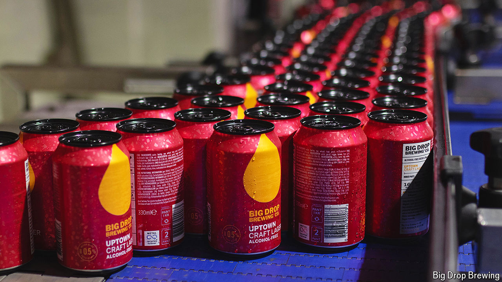

###### Alcoblocks

# When is a non-alcoholic drink alcohol-free? 

##### A quirk of regulation is holding back growth in the British market 

 

> May 21st 2024 

Not that long ago asking for an alcohol-free beer in a British pub made you seem weird. Less so now. Alcohol consumption is falling among young, affluent and health-conscious consumers. Better brewing techniques have introduced tastier non-alcoholic options. Sales of alcohol-free beer rose by 26% in 2022. 

Even so, the overall market is still tiny. Non-alcoholic beverages make up a sliver of Britain’s booze market, at just 3%. That is comparable to the share in France and America but far behind that in Germany (16%) or Spain (11%), according to the IWSR, a research firm. Sales growth of alcohol-free drinks would need to exceed 40% each year to come close to raising their market share above 10% by 2030, according to the Social Market Foundation, a think-tank. 

