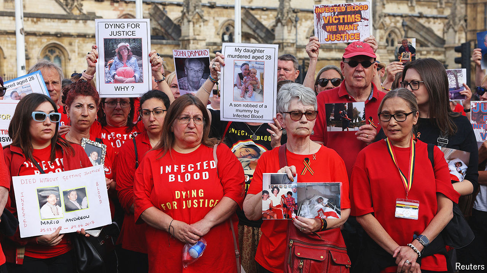

###### Blood, debt and tears

# “A day of shame” for the British state 

##### The biggest scandal in the history of the NHS is at last properly acknowledged 

 

> May 20th 2024 

DEREK MARTINDALE was 23 in 1985, when he was told that he had HIV and 12 months to live. He survived but his younger brother Richard, who also contracted the virus, did not. After Richard died in 1990 Mr Martindale asked to see his brother’s body one last time but was refused. Such was the fear of AIDS that hospital staff had already stitched closed his brother’s nose, mouth and eyes. 

Mr Martindale is one of more than 30,000 Britons who were infected with HIV and hepatitis C through treatment in the National Health Service (NHS) in the 1970s and 1980s; around 3,000 of them have died to date. Mr Martindale was also the first victim to testify at the public inquiry into the infected-blood scandal, which was set up after decades of delays in 2017. And on May 20th this year he was in a conference centre in central London to hear Sir Brian Langstaff, the chair of that inquiry, present his final report. 

