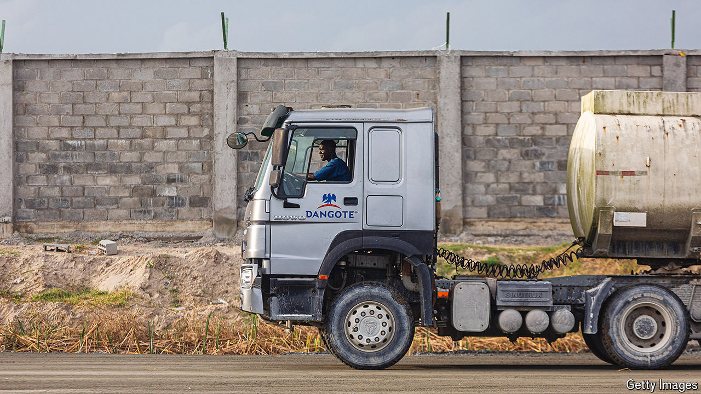

###### Big game

# Africa Inc is ready to roar 

##### Its businesses are expanding across the continent 

 

> May 23rd 2024 

Global gabfests tend to be gloomy affairs these days. Bigwigs bemoan the state of geopolitics, wring their hands over existential risks, urge greater global co-operation—and go home with little to show for it all. The Africa CEO Forum, a gathering that took place on May 16th and 17th in Kigali, the capital of Rwanda, offered a welcome contrast. As bosses, politicians and financiers gathered to discuss the role of Africa’s private sector in spurring its economic development, the tone was refreshingly practical.

Instead of dwelling on the grand sweep of history or the changing world order, the conference’s attendees knuckled down for discussions on how to boost cross-border commerce and strengthen local supply chains. Permeating all of this was a conviction that Africa must take control of its own economic development. As Aliko Dangote, the boss of Dangote Industries, a Nigerian conglomerate, and Africa’s richest man, summed up, “We Africans will have to do it. If we wait for foreigners, it’s not going to happen.”

