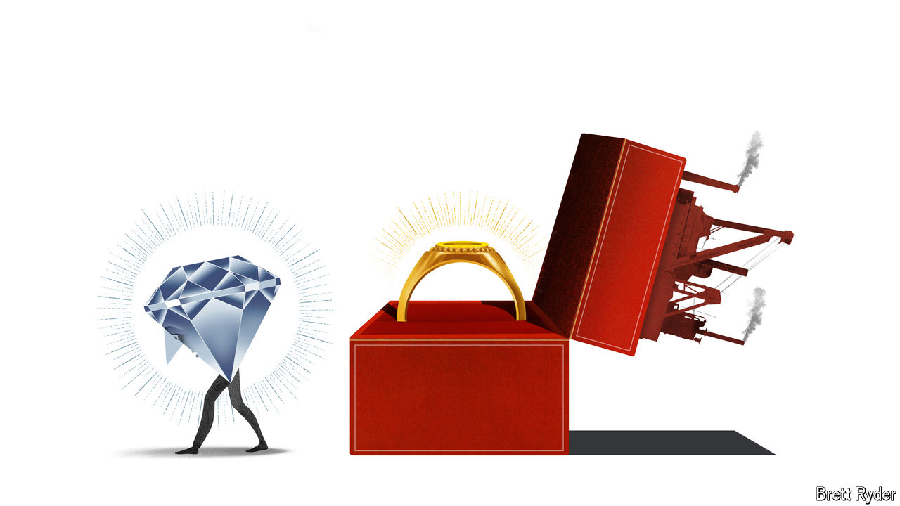

###### Schumpeter

# Can anyone save the world’s most important diamond company? 

##### De Beers is in peril 

 

> May 22nd 2024 

In February 1908 Joseph Asscher, a master cutter of diamonds, cleaved the Cullinan at his workshop in Amsterdam. So tough was the South African diamond, the largest ever found, that Mr Asscher’s first attempt split his blade instead. The diamond industry is once again gripped by a nail-biting separation. This time, its most important company is facing the chop.

After rejecting a takeover proposal from BHP, the world’s biggest miner, Anglo American announced a radical restructuring of its business on May 14th. As well as selling its coal, nickel and platinum operations, the British mining firm will shed its 85% stake in De Beers (Botswana, where its richest diamond mines are located, owns the rest). BHP has until May 29th to make a new offer for Anglo. Whatever happens, De Beers’s change of ownership will mark the end of one of its most enduring relationships—Ernest Oppenheimer, Anglo American’s founder, joined the company’s board in 1926. For the industry, it signals the biggest shake-up since 2000, when De Beers abandoned its policy of trying to control diamond prices by managing supply. 

