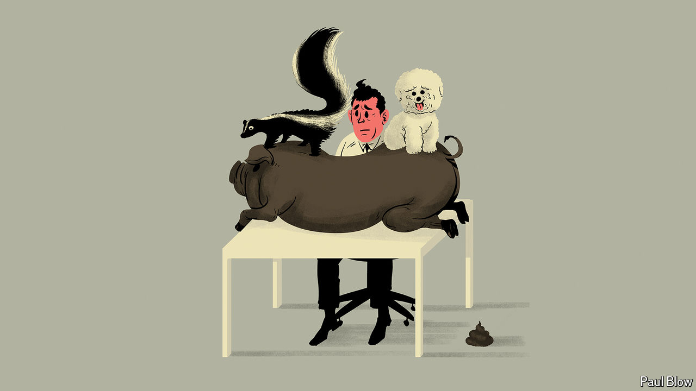

###### Bartleby

# The Economist’s agony uncle returns 

##### Pets, drugs and schedule send: another postbag for Max Flannel 

 

> May 23rd 2024 


You are not alone: I probably get more letters about this topic than any other. It’s very hard to admit to disliking dogs, so lots of people end up suffering them in silence. You could talk to HR about ending the policy, but would risk being known to all your colleagues as the psychopath who hates puppies. It’s much better to try to subvert the system. My advice is to say that you need to bring another type of much less acceptable animal to the office. If pressed, use the word “wellness” and hint at discrimination if they do not seem keen. With luck they will reach the conclusion that it is best simply to ban all pets. 

