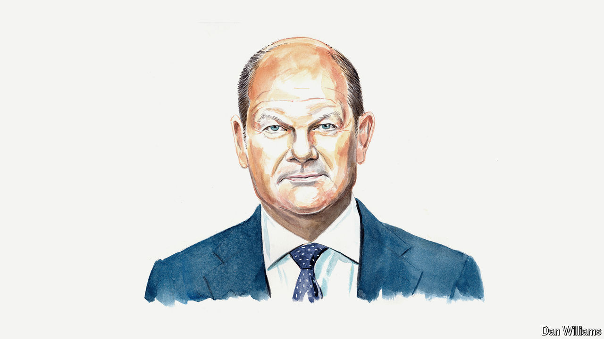

###### European security

# Olaf Scholz on why Vladimir Putin’s brutal imperialism will fail 

##### Germany’s chancellor says Europe needs more military muscle 

 

> May 23rd 2024 

EARLIER THIS month, outside the small Lithuanian town of Pabradė, alongside Lithuania’s president, Gitanas Nausėda, I witnessed German Boxer tanks roaring over a sandy plain. Less than 10km from the border with Belarus, deafening mortar shells were being fired. Bushes and trees were cast in thick layers of smoke. And yet the contrast could not have been greater compared to the time when Adolf Hitler’s Wehrmacht marched into Lithuania 83 years ago and turned that country and the other states of Central and Eastern Europe into “bloodlands”—a term aptly coined by Timothy Snyder, a historian. This time, German troops came in peace, to defend freedom and to deter an imperialist aggressor together with their Lithuanian allies.

It is at moments like this that you realise how far Europe has come. Former foes have become allies. We have torn down the walls and iron curtains that separated us. For decades, we even managed to banish war between our peoples to the history books. Because we all adhered to a few fundamental principles: never again must borders be changed by force. The sovereignty of all states, large and small, has to be respected. None of us should ever have to live in fear of our neighbours again.

