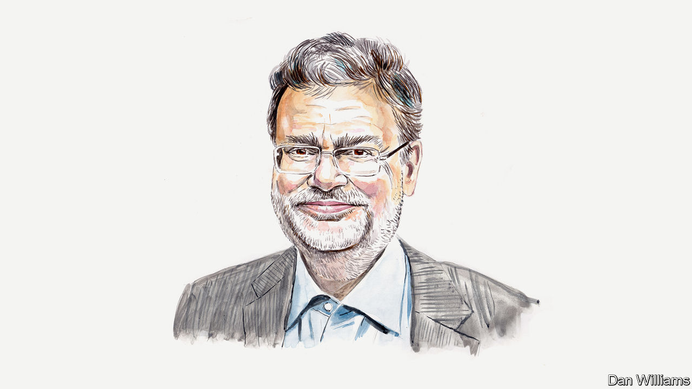

###### Israel, America and the ICC

# Powerful states are finding it harder to dodge legal challenges, says Marc Weller 

##### The law professor believes the ICC’s creeping jurisdiction is part of a broader trend 

 

> May 23rd 2024 

LAW IS A leveller. It allows the weak to defeat the strong. An issue is decided according to agreed standards, not relative power. And these standards supposedly apply equally to all. Moreover, the ruling of an independent court can be enforced through the institutions of the state.

In the international arena, the rules have traditionally been different. While states are also supposedly equal in the eyes of international law, international decisions have depended largely on power relations. There is simply no mechanism to determine which state is acting in accordance with international law and which is not, unless the parties to a given dispute have consented to it. Strong states fiercely defend the sovereign freedom to claim to be in compliance with their obligations in the absence of any binding mechanism to verify that assertion.

