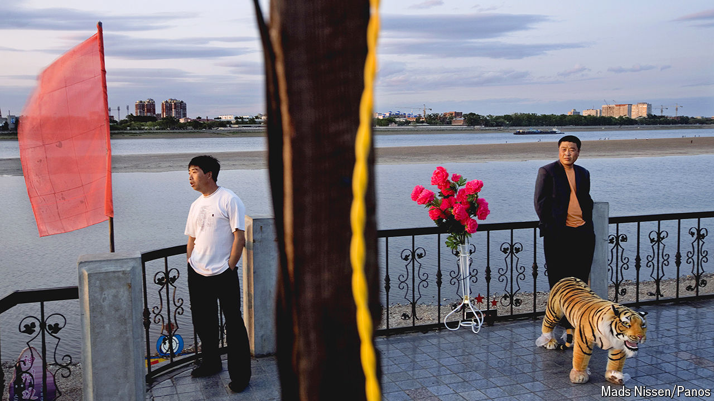

###### A tale of two Chinas

# Even Xi Jinping is struggling to fix regional inequality 

##### Will China’s vast hinterland ever catch up with its wealthy coast? 

 

> May 21st 2024 

TO UNDERSTAND WHAT China’s leaders care about, look at where they travel. Earlier this month Li Qiang, the prime minister, spent three days in Xinjiang, a poor area in western China where he ordered local authorities to boost incomes and employment. At the same time Mr Li’s deputy, Ding Xuexiang, went to Shenyang, a city in China’s north-eastern rustbelt. Mr Ding called for the region’s “revitalisation”. Two weeks before all that, the supreme leader, Xi Jinping, presided over a symposium in the city of Chongqing where he heralded a “new chapter” in the development of China’s western region.

China’s leaders are trying to fix a problem that has dogged the country for decades: how to spread  more evenly. GDP per person in the west and north-east, which make up most of China’s land mass and hold a third of its population, is 70,870 yuan ($9,800) and 60,400 yuan, respectively. Along the coast it is 124,800 yuan. China’s richest provincial-level unit, Beijing, is four times wealthier than its poorest, Gansu (see map). And the richest areas are pulling further ahead.

