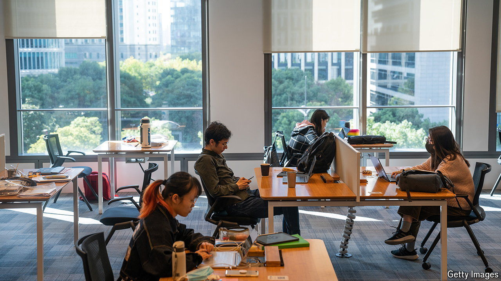

###### Study buddies

# The number of American students in China is going up again 

##### But it pales in comparison to the number of Chinese students in America 

 

> May 23rd 2024 

ON HIS VISIT to China last month Antony Blinken, America’s secretary of state, spent time talking to students at New York University’s Shanghai campus. Both countries, he said, needed to develop “rising generations who know each other, who know about each other and, hopefully, who understand each other”. For America that has become more difficult. The number of American students studying in China fell from a high of around 15,000 in the 2011-12 school year to a low of around 300 during the covid-19 pandemic. 

The good news is that the number has been creeping back up again, to around 800 today. And there are signs that both sides want to see it rise higher. When China’s leader, Xi Jinping, visited San Francisco in November he announced a plan to bring 50,000 young Americans to China through exchange and study programmes over the next five years. 

