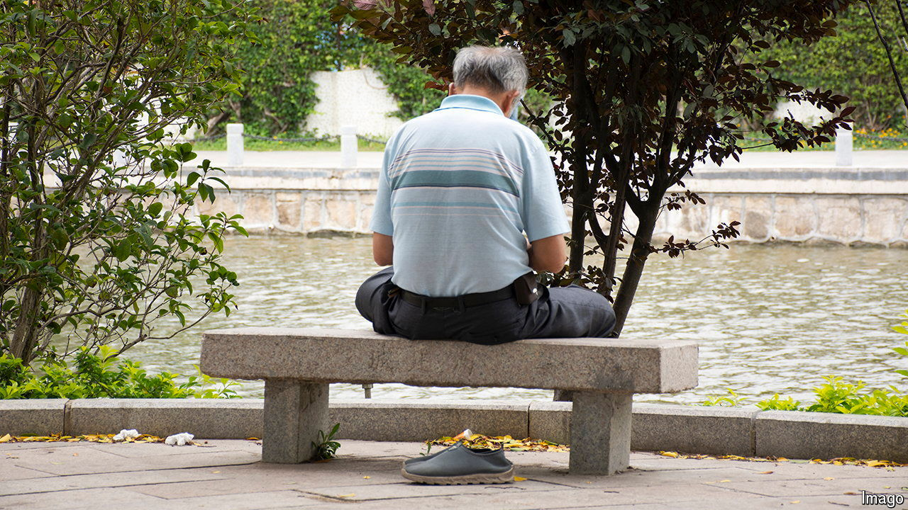

###### One way to stay spry

# Why Hong Kong is sending its old people to Guangdong 

##### Gardens and bigger rooms await 

 

> May 23rd 2024 

Yee Hong Heights, just outside the city of Shenzhen, looks more like a mountain retreat than a care home. Its 260 residents can wander through gardens fringed with palm trees. But the classes on how to use an iPad are perhaps more important. Some 70% of the residents come from Hong Kong. The training allows them to talk with their children back in the city.

More and more Hong Kongers are living out their twilight years in Guangdong, the province where Shenzhen is located. Around 89,000 people aged 65 or over were “usually staying” in the region last year, according to official data. That’s 32% more than a decade earlier. Hong Kong’s government is behind the rise. In 2014 it launched a scheme that covers living costs and cross-border transport for old people needing care who opt to move to Guangdong. It pays for most of the Hong Kongers at Yee Hong Heights.

