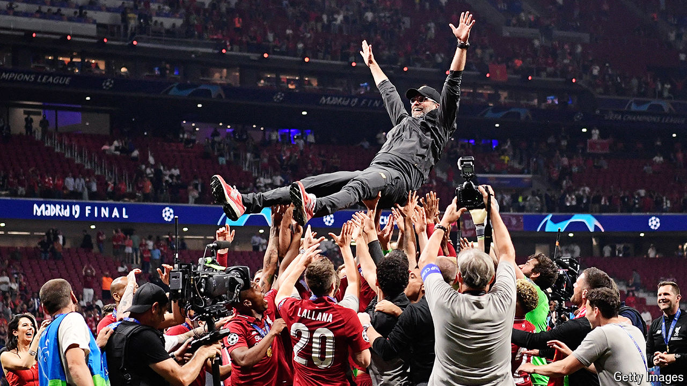

###### Back Story

# Jürgen Klopp’s masterclass in how to win—and lose 

##### Two gestures capture the Liverpool manager’s method: the fist pump and the hug 

 

> May 17th 2024 

An obvious way to recount ’s time as manager of Liverpool, one of the grandest clubs in the world’s most popular sport, is in titles and accolades. Between his first match in 2015 and his last on May 19th, he won seven major trophies. But a neater encapsulation of the German coach’s impact lies in a pair of gestures. Together they form a pictographic guide to management in football and beyond—and even to a philosophy of life.

The first gesture is an alpha-male expression of triumph. After big wins at Anfield, Liverpool’s home ground, Mr Klopp skipped over to the Kop, a grandstand which, even at a club followed more fervently than most, is known for its passionate supporters. To adoring roars, he punched the air once, twice, three times. Then he thumped the Liverpool badge on his chest. The fist pump was both a party and a promise. 

