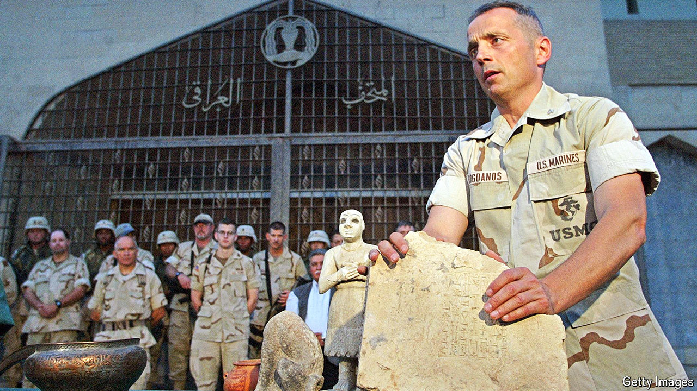

###### The art cop

# Meet the man causing cracks in the antiquities trade 

##### Matthew Bogdanos employs unorthodox tactics to repatriate stolen art and antiquities 

 

> May 23rd 2024 

Museums used to make the news for big acquisitions. Today, however, you are just as likely to read a headline about art being given up to the authorities or . New York, capital of the global art market, has become a hub for restitution efforts. In the past month 38 antiquities were returned to China, 27 to Cambodia, ten to Egypt and three to Indonesia. All were stolen, according to state law in New York. Behind these repatriations was the office of the Manhattan district attorney (DA), and specifically its Antiquities Trafficking Unit (ATU), led by Matthew Bogdanos.

If New York is filled with art dealers, Mr Bogdanos (pictured) is the un-dealer. Since its creation in 2017, the ATU estimates it has recovered 5,776 objects worth an estimated $456m (see chart). “We don’t approach you unless we’ve got you covered six ways from Sunday,” says Mr Bogdanos. With his tough-guy rhetoric, Mr Bogdanos can sound like a cross between Indiana Jones and Robin Hood, though his work has also earned him detractors. “He’s bullying people into returning things with the threat of jail,” says a lawyer and antiquities expert. Still, many are watching Mr Bogdanos to see whom he will take on next and how his tactics might inspire other authorities abroad.

