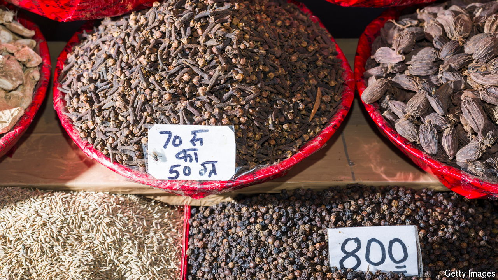

###### The spice of life

# Spices have their own riveting, piquant history 

##### How spycraft and cartography flourished in their wake 

 

> May 22nd 2024 

By Roger Crowley. 

THEY LOOKED humble enough. One observer compared clove plants to laurel shrubs, while nutmeg, he noticed, grew on something resembling the pear tree. Despite their common appearance, in the 16th century these spices were special—and not just because, by a fluke of evolution, they grew only on a handful of islands in the Malay Archipelago, which came to be known as the Spice Islands. As Roger Crowley, a British maritime historian, explains in an engaging new look at seasoning’s long ago seasons, nutmeg and cloves would have effects far beyond the kitchen, kindling revolutions from mapmaking to spycraft.

