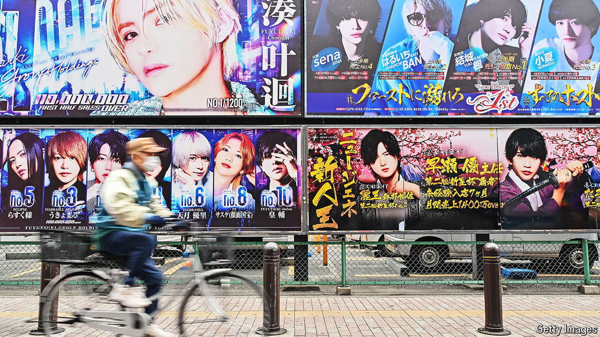

###### Heavenly hosts

# The controversial cult of the host club in Japan 

##### Why women pay men in make-up to flatter them 

 

> May 21st 2024 

In Kabukicho, a red-light district in Tokyo, four young men surround your female correspondent. Hiragi Saren, a 25-year-old with bleached hair, a black tank top and a silver necklace, sits closest. He chatters warmly and glances seductively, his pink eyeshadow glimmering under the chandeliers. His three assistants keep filling your correspondent’s  glass and shower her with compliments about her appearance. She doubts their sincerity, but is strangely pleased. After an hour and a half, the bill is ¥30,000 ($200).

Host clubs are booming in Japan. Some 21,000 hosts—well-dressed young men, often wearing make-up like K-pop stars—work at 900 such establishments. They pamper and flatter their female clients. Sex is not part of the bargain but could happen, somewhere else. Clients usually seek psychological rather than physical intimacy and a break from reality. Hosts refer to them as  (princess), and never ask how old they are or what they do for a living.

