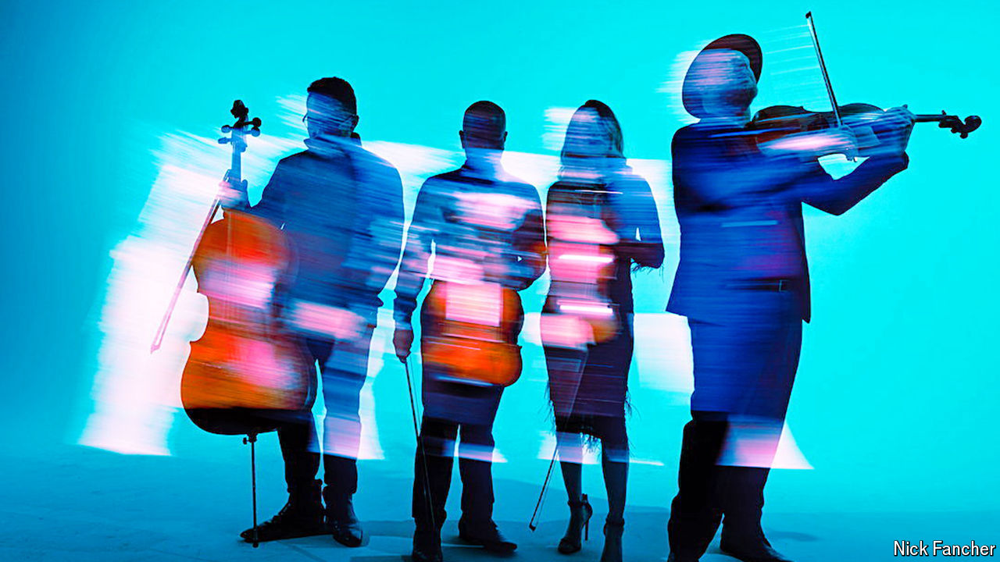

###### The “Bridgerton” effect

# The hit series “Bridgerton” has set off a string-quartet boom 

##### It is a surprising example of how popular culture can shape consumer habits 

 

> May 20th 2024 

PITBULL DOES not make the kind of music you would describe as romantic. Listeners are unlikely to swoon when they hear the American rapper’s lyrics, such as “I’m the plumber tonight / I’ll check yo’ pipes.” And yet when a couple start kissing in a horse-drawn carriage in the new season of “Bridgerton”—which debuted on Netflix on May 16th—they do so to a cover of Pitbull’s “Give Me Everything” played by a string quartet. Remove the braggadocio lyrics, add staccato violins and a song can go from gross to engrossing.

With vibrant costumes and focus on the marriage market, “Bridgerton” positions itself as a . Viewers have spent almost 1bn hours watching the first season, and nearly 800m with the second, according to Netflix. The series has sent internet searches for corsets and wisteria soaring. It has also made string quartets more fashionable than they have been in centuries.

