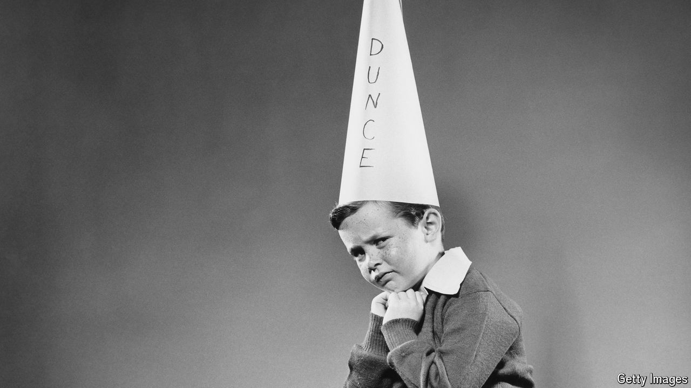

###### A modern Orwellian tale

# What if calling someone stupid was a crime? 

##### Lionel Shriver imagines cancel culture going to even greater extremes 

 

> May 17th 2024 

By Lionel Shriver. 

ARE YOU hateful enough to use the S-word? You know the one: stupid. It has been banned in schools, its use and synonyms (dumb, slow) considered “slurs” worthy of expulsion. Even its antonyms are grounds for book bans and boycotts: only a “cerebral supremacist” would have the gall to buy Elena Ferrante’s novel Instead, those wanting to be politically correct display copies of “The Calumny of IQ: Why Discrimination Against ‘D— People’ Is the Last Great Civil Rights Fight” on their coffee tables.

