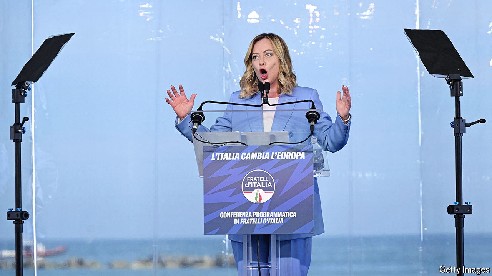

###### Pragmatist or pasionaria?

# As the Euro-elections loom, Giorgia Meloni guards her right flank 

##### Matteo Salvini looks like being Italy’s big loser 

 

> May 23rd 2024 

Just when her European counterparts felt they had her taped as a realistic, if staunch, conservative, Italy’s prime minister, Giorgia Meloni, popped up on May 19th at a rally in Madrid organised by the Spanish hard-right party Vox, seemingly happy in the company of such hardliners as Marine Le Pen from France and Argentina’s libertarian president, Javier Milei. Since coming into office, Ms Meloni has largely eschewed Eurosceptic talk, aware that Italy stands to receive almost €200bn ($217bn) from the EU’s pandemic-recovery fund. But speaking by video-link to the crowd in Madrid, she lambasted the European Commission as “a bureaucratic giant that aspires to regulate every aspect of our lives while being unable to offer a clear geopolitical vision”. She promised a different Europe, but left fuzzy the outlines of her nativist nirvana.

The European elections will be the most important test so far of Italy’s right-wing coalition. But the opposition, split between the centre-left Democratic Party (PD), the populist Five Star Movement and various centrist groups, presents no great challenge. Polls have given her Brothers of Italy (FdI) party around 27% of the vote, a percentage point more than at the general election in September 2022. That puts the Brothers about seven and 12 points ahead of the PD and Five Stars respectively.

