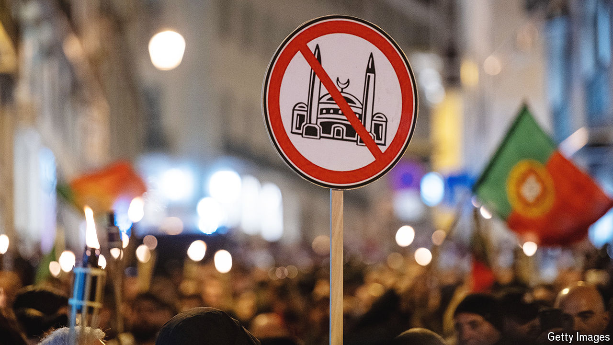

###### Who hates whom?

# How the hard right both reflects and creates prejudice 

##### It’s one way to get votes 

 

> May 23rd 2024 

GEERT WILDERS is the most powerful politician in the Netherlands. His party came first in the general election last November and will be the biggest in the new government. He is also a convicted hate-monger. Dutch courts found him guilty of “insulting a population group” in a speech in 2014. Mr Wilders’s offence was to lead an audience in a chant that called for kicking out “Moroccans”—people of Moroccan descent, who form the Netherlands’ most stigmatised ethnic group.

This seems bizarre. The Netherlands and Morocco are far apart and have no history of conflict. But there is a large Moroccan-Dutch minority stemming from guest-worker programmes launched in the 1960s. As Muslims they are targets of religious prejudice, and their young men commit more crimes than other Muslim groups. So since Dutch politics turned rightwards in the 2000s, race-baiters have singled them out. In 2016 a report by the EU’s Agency for Fundamental Rights, found the Netherlands had the most discrimination against North Africans of all countries surveyed.

