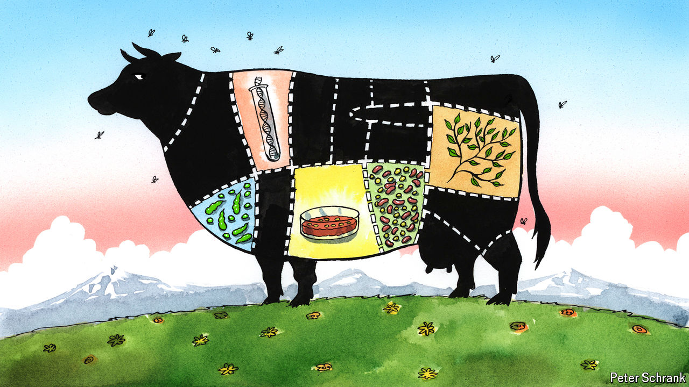

###### Charlemagne

# The fight over meat-free meat pits Europe’s traditionalists against foodie innovators 

##### The steaks are high 

 

> May 23rd 2024 

Would A  by any other name taste as juicy? What if it featured only imitation “meat”, cleverly recombined vegetable protein disguised as beef? To traditionalists in France—starting with farmers who rear the soon-to-be steaks—the answer is a resounding . A decree passed in February and due to come into force on May 26th spells out that all meaty terms, whether it be an , a  or even a , are to be reserved for cuts of dead animals and nothing else. Those who fret that Europe may be consumed by war and economic torpor will be heartened to see its leaders can still find the time to keep dastardly vegan burgers off the menu. But not everyone is happy. A budding industry of startups increasingly able to produce cutting-edge faux flesh in Petri dishes is wondering whether this is yet another case of Europe regulating first, thus innovating never. Can Charlemagne chew his way through this meaty debate?

Whereas Americans indulge in soy milk or vegan yogurt, Europeans have to make do with “soya drink” and something ominously called “oatgurt”. Imposing this odd nomenclature on non-dairy substitutes mattered little in the 1980s, when the European Union first caved in to lobbying by farmers dealing in actual mammaries. (Peanut “butter” and ice “cream” were among the few exceptions tolerated.) These days supermarket shelves are stuffed not just with oatgurt but with vegan burger patties and “no-fish fingers”. Having convinced politicians Champagne must hail from the eponymous French region and Parmesan cheese only from Parma, Big Farm has tried to extend its grip even to generic agricultural terms. A bid to outlaw vegetarian sausages—or at least calling them sausages—made headway at EU level in 2020 but narrowly failed. Now individual countries have taken over the task. France revived a previously shelved ban on meaty terms, which it unveiled (not uncoincidentally) at the height of farmers’ protests earlier this year. A few months earlier Italy earmarked “salami” for pork products; Poland has considered a similar move.

