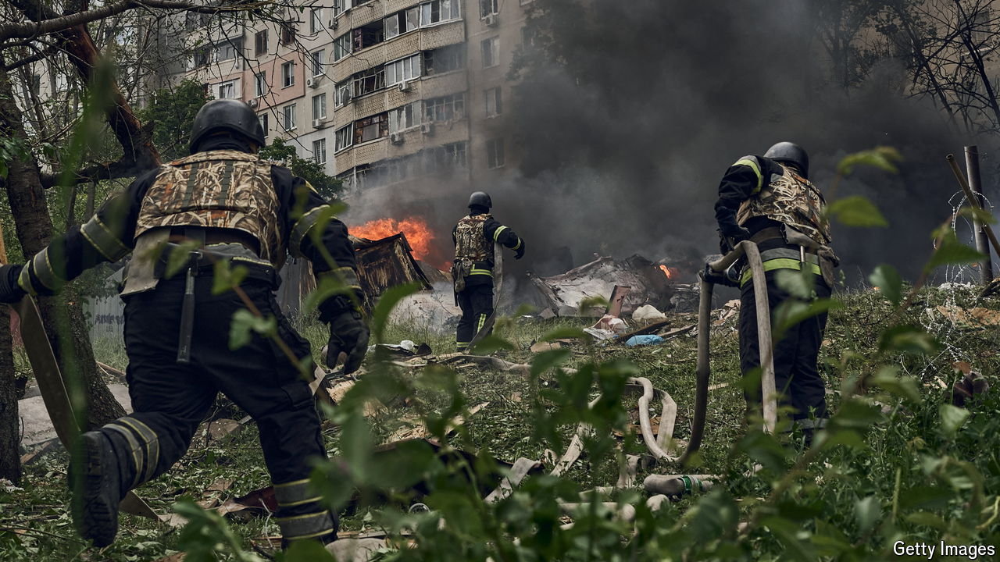

###### A city under threat

# Ukraine’s desperate struggle to defend Kharkiv 

##### It is holding off Russia’s attack — for now 

 

> May 20th 2024 

ANNA SITS in silence for most of the car journey from Kyiv to Kharkiv, her face contorted with worry. “The Russians come closer, closer, closer, but he’s just not listening to me,” she says. Anna made a point of visiting her 75-year-old father regularly, checking in on him at the simple brick house he built 45 years ago near Kharkiv’s glimmering Pechenihy reservoir, east of the city and close to the Russian border. This time, with the din of artillery in the background, she had come to persuade him to leave—to escape a Russian advance already enveloping Vovchansk, 25km to the north. After a hug and a few tears, the initial conversation does not go well. “The TV and radio say it can’t get worse,” insists Petro. “The Russians are losing. Sanctions, losses. Reinforcements are coming our way. They can’t come further.”

Ten days after the start on May 10th of  in Kharkiv province, the pace of the advance has slowed. For now, Ukraine is holding the Russians roughly halfway through Vovchansk—a town, just 5km from the border, that is now being turned to ashes—and at positions roughly 9km inside Ukraine further west, near Lyptsi. With an estimated 48,000 troops ready, Russia does not have the forces for a major attack on Kharkiv city, Ukraine’s second biggest. But local military leaders insist that the situation remains precarious, and could change quickly. Russian columns were halted only after several experienced brigades were redeployed and came to the rescue, one says; Vladimir Putin will “surely” try his luck by opening a new attack elsewhere in the region. 

