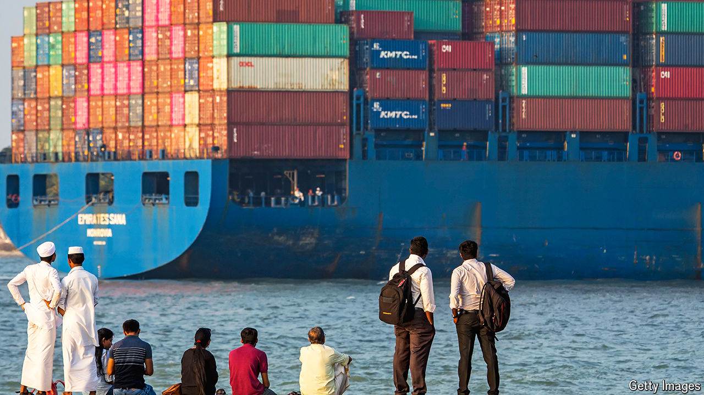

###### Trade wars

# Brazil, India and Mexico are taking on China’s exports 

##### To avoid an economic shock, they are pursuing a strange mix of free trade and protectionism 

 

> May 23rd 2024 

At last, it seemed time for a manufacturing take-off. Having struggled to compete with China’s industrial might, other emerging markets stood ready to benefit as their rival’s labour costs surged and rising tensions between it and the West pushed firms to look for new factory locations. Last year foreign direct investment into China fell to a 30-year low.

But China has started to fight back. To reverse an economic slowdown and cement its control over global supply chains, its leaders have launched an investment spree in high-tech goods, such as batteries, electric vehicles and other green devices. Weak domestic demand for traditional products, such as cars, chemicals and steel, mean they are also flooding global markets. The average price of Chinese manufactured exports fell by nearly 10% from 2022 to 2023. China’s export volumes have surged to near-record levels. 

