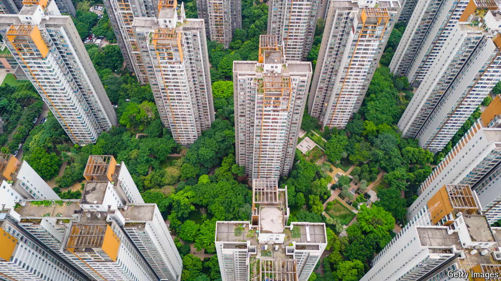

###### An aid to digestion

# How the Chinese state aims to calm the property market 

##### Officials appear willing to spend public money on private capitalists 

 

> May 23rd 2024 

Three decades ago much of the housing in China’s cities belonged to state-owned enterprises, which provided homes to workers at low rents. A lot has changed since then. China is now blessed, if that is the right word, with a sprawling commercial property market, which has produced vast numbers of flats and equal amounts of drama. Since the height of the last boom in 2020, sales have dropped by more than half. To try to put a floor under the market, China’s government has turned to a new, old solution. It wants state-owned enterprises to step in to buy unsold property and turn it into affordable housing.

The policy was announced on May 17th after an unusual video conference by He Lifeng, China’s economic tsar. The country’s central bank will offer cheap loans worth up to 300bn yuan ($42bn) to 21 banks, which will in turn lend to eligible enterprises owned by city governments. These firms will use the money to buy finished but unsold flats from property developers, including private-sector ones. The flats can then be either sold or rented at below-market rates to low-income buyers.

