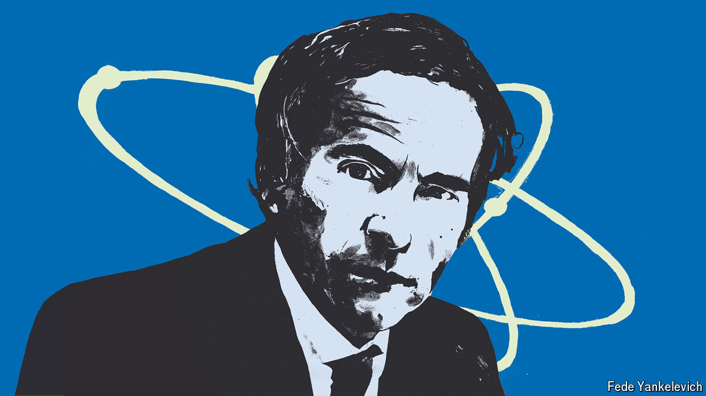

###### An interview with Rafael Grossi

# Iran’s new leaders stand at a nuclear precipice 

##### The world’s atomic watchdog fears a terrifying regional arms race 

 

> May 20th 2024 

ON MAY 6TH Rafael Grossi, the director-general of the International Atomic Energy Agency (IAEA), travelled to Tehran and met Hossein Amirabdollahian, Iran’s foreign minister. Less than two weeks later, on May 19th, Mr Amirabdollahian was dead,  that also took the life of Ebrahim Raisi, Iran’s president, among others.

Their deaths throw Iran’s sclerotic theocracy into a moment of confusion and uncertainty, one with far-reaching implications for the country’s nuclear programme. Mr Grossi, fresh from his trip to Iran, recently spoke to  about the Iranian nuclear file, as well as the other items on his forbidding to-do list, from the Russian-occupied  in Ukraine to the “growing attraction” of . 

