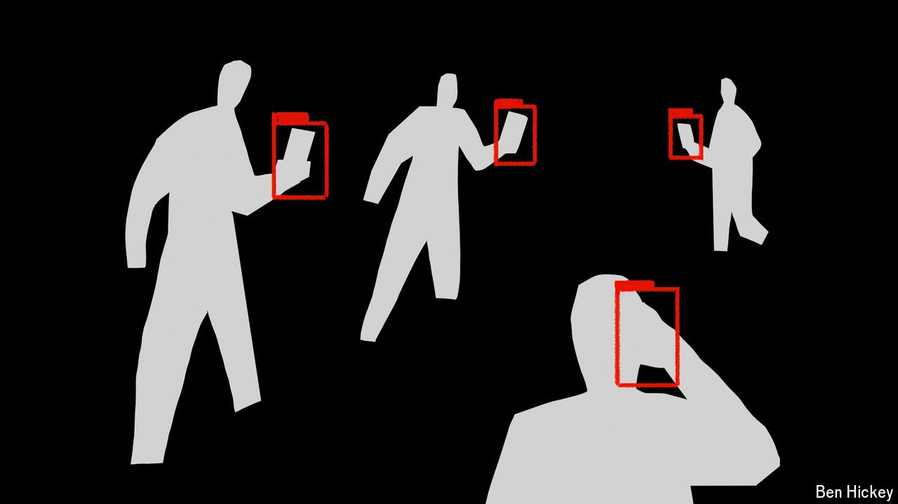

###### Security alert

# Hacking phones is too easy. Time to make it harder 

##### Regulators have avoided the problem for too long 

 

> May 23rd 2024 

In the mid-1960s enterprising hackers realised that if they blew a particular toy whistle down the phone, they could trick the network into routing their call anywhere, free. When phone networks got wind of this, they changed how the system worked by splitting the channel carrying the voice signal from the one managing the call. One result was the Signalling System 7, which became a global standard in 1980. ss7 stopped “phone phreaks”, as they were known. But the system, built when there were only a handful of state-controlled telecoms companies, has become woefully inadequate for the mobile age, leaving dangerous vulnerabilities at the heart of . It is time to fix them.

For more than 15 years experts have known that SS7 (or, occasionally, a later system called Diameter) could be abused to locate a phone user, intercept their text or voice data, or send texts or  to a device. Russia has exploited SS7 to track dissidents abroad. In 2018 the United Arab Emirates is thought to have used it to find and then abduct a fugitive princess. Earlier this year an American cyber-security official told the Federal Communications Commission (FCC), a regulator, that similar attacks had taken place in America.

