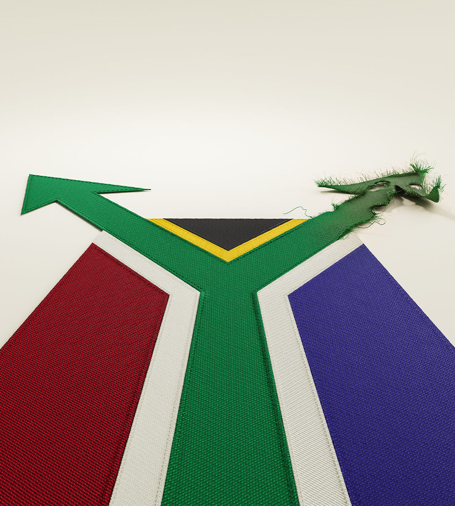

###### 30 years after apartheid

# How to save South Africa 

##### The rainbow nation needs an alternative to decline under the ANC 

 

> May 23rd 2024 

In 1994 South Africa provided some of the most joyous scenes of the late 20th century, when it elected Nelson Mandela as its first black president. The more or less peaceful transition from apartheid to multiracial democracy demonstrated what can happen when political enemies show courage and imagination. Yet as our Briefing this week explains, 30 years later the question is whether South Africa’s hard-won democracy can reverse the country’s . After a creditable first decade, Mandela’s African National Congress (ANC) has presided over economic stagnation, rampant crime, failing public services and epic corruption. Most South Africans say they would do away with elections if an unelected government could provide safety, jobs and housing.

When they vote on May 29th, they should throw out a party that has proved unable to govern. But that seems unlikely. Many voters still associate the ANC with liberation itself. So the next five years will test whether South Africa’s young institutions can withstand yet another assault from predatory politicians, and whether its opposition can reinvent itself. Despite all the difficulties, South Africa still has a fighting chance.

