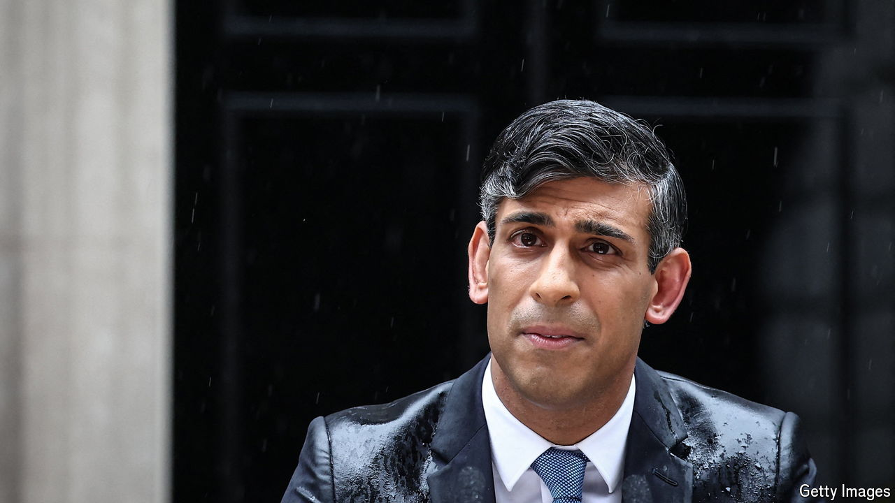

###### July 4th celebration

# Rishi Sunak’s election call makes no sense, but is good news 

##### Whether an act of political genius or lunacy, Britons should welcome it 

 

> May 22nd 2024 

An old axiom of British politics is that the Conservative Party is ruthless in its pursuit of power. Lately it has seemed relentlessly focused on losing it. It has purged talented MPs who did not toe the ideological line on Brexit, a cause that a majority of voters now think was wrong. In Boris Johnson, it picked a leader manifestly unsuited for high office. In Liz Truss, it installed the shortest-lived prime minister in British history and the person who shredded the party’s reputation for economic competence. Now, after taking a long, hard look into the electoral abyss, it has gone ahead and jumped.

On May 22nd Rishi Sunak, the current prime minister, announced that the next general election will be held on July 4th. Mr Sunak could have waited until the end of the year to call a vote. Given the enormous poll lead enjoyed by the Labour Party, the hope that things might somehow improve seemed to most observers like the Conservatives’ only reasonable strategy. Our  currently gives them a chance of less than 1% of winning the election. Instead,  has opted to try his luck.

