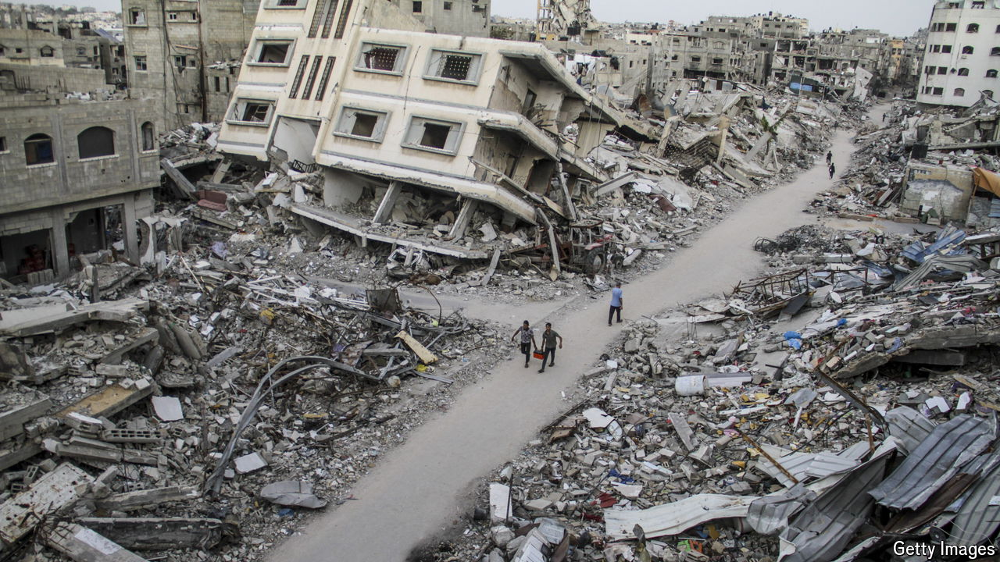

###### Lawfare v warfare

# The war-crimes case against the leaders of Israel and Hamas is flawed 

##### Politics and diplomacy, not courts, are the key to ending violence and starting two-state talks 

 

> May 23rd 2024 

The GAZA war is a diplomatic disaster for Israel, a military quagmire and a human tragedy. In has stepped Karim Khan, prosecutor of the International Criminal Court (icc), who has accused Israeli and Hamas leaders of war crimes. He believes he is creating moral clarity, asserting the primacy of international law and thereby delivering justice. On all three counts he is likely to be disappointed.

On May 20th Mr Khan asked icc judges to issue five arrest warrants. Two target the brains behind Hamas’s atrocities: Muhammad Deif and Yahya Sinwar, holed up in ; a third is for Ismail Haniyeh, its political chief, who is in Qatar. Mr Khan also asked for warrants for , Israel’s prime minister, and the defence minister, Yoav Gallant, whom he accuses of inflicting starvation, murder and extermination. 

