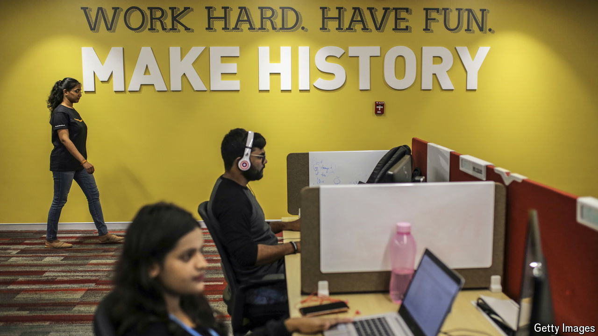

###### The new brains trust

# What India’s clout in white-collar work means for the world 

##### In time its tech firms could be as formidable as China’s manufacturers 

 

> May 23rd 2024 

India HAS long been seen as the world’s “back office”. Tata Consultancy Services (TCS), an IT firm now worth $170bn, undertook its first project for an American client in 1973, reworking the accounting software of a hospital in Detroit. The rise of “global capability centres”, where multinational companies carry out complex tasks, from design to research, is increasingly making that view out of date. The question is whether GCCs will themselves be superseded, too, as India creates some  of its own. 

Back-office firms still matter to . The IT sector is a juggernaut, generating about $250bn in annual revenues, or 7% of GDP. But GCCs are increasingly important, too. The country now hosts some 1,600 of them. Amazon’s biggest office in the world is in Hyderabad. A fifth of Goldman Sachs’s staff are in India, as are a fifth of the world’s chip designers. New GCCs are opening at a rate of roughly one a week. 

