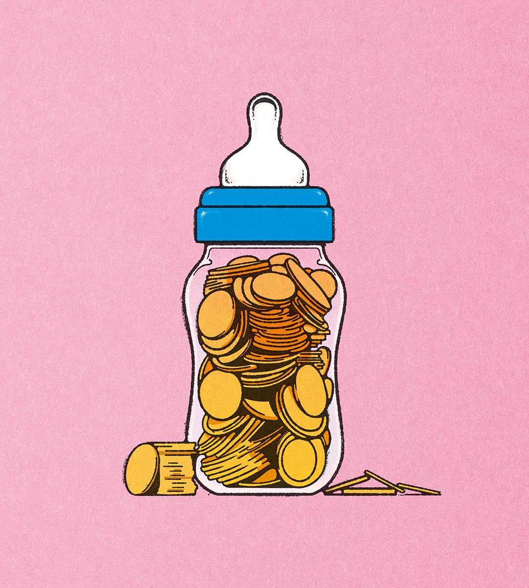

###### Cash for kids

# Why paying women to have more babies won’t work 

##### Economies must adapt to baby busts instead 

 

> May 23rd 2024 

As birth rates plunge, many politicians want to pour money into policies that might lead women to have more babies. Donald Trump has vowed to dish out bonuses if he returns to the White House. In France, where the state already spends 3.5-4% of gdp on family policies each year, Emmanuel Macron wants to “demographically rearm” his country. South Korea is contemplating handouts worth a staggering $70,000 for each baby. Yet all these attempts are likely to fail, because they are built on a misapprehension.

Governments’ concern is understandable. Fertility rates are falling nearly everywhere and the rich world faces a severe shortage of babies. At prevailing birth rates, the average woman in a high-income country today will have just 1.6 children over her lifetime. Every rich country except Israel has a fertility rate beneath the replacement level of 2.1, at which a population is stable without immigration. The decline over the past decade has been faster than demographers expected. 

