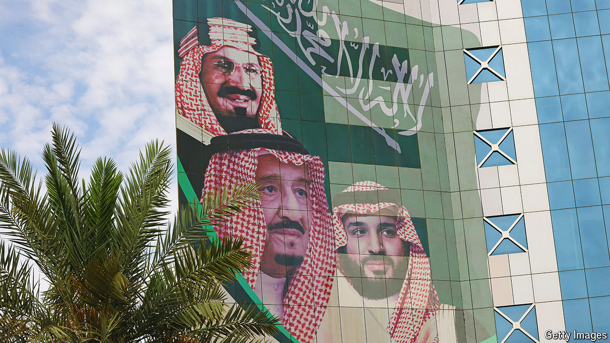

###### Succession

# A death, an illness, and an uncertain Middle East 

##### The region could be on the cusp of real change 

 

> May 23rd 2024 

SINCE march 2023, when Iran and Saudi Arabia agreed to restore diplomatic ties, the two longtime foes have tried to put on a show of friendship. The routine has not been convincing. Then, for a moment this month, they seemed to take the unity act to another level. The Iranian president vanished, and the Saudi king fell ill. It was a reminder that both countries are on the brink of profound transition.

Ebrahim Raisi’s death in a helicopter crash on May 19th plunged Iran into political uncertainty. But anyone hoping it will become less belligerent in the region is likely to be disappointed. Mr Raisi was not the main architect of Iran’s foreign policy. Regardless of who replaces him as president, Iran will continue to support militias across the Middle East and to seek closer ties with Russia and China. Nor is its nuclear stand-off with the West likely to ease.

