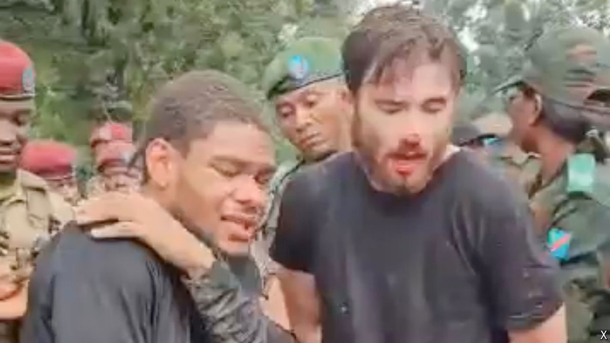

###### The coup will not be televised

# A live-streamed attempted coup in Congo shakes the region 

##### The involvement of Americans in the botched putsch is embarrassing for Washington as it tries to maintain influence 

 

> May 23rd 2024 

In the very early hours of May 19th around 50 armed and camouflaged men screeched through Kinshasa, Congo’s capital. First they attacked the home of Vital Kamerhe, a government minister. After a fruitless 40-minute firefight with his guards, the attackers moved on to the Palais de la Nation, the official residence of Félix Tshisekedi, the president. 

There, the supposed leader of the coup had ample time to live-stream his rebellion on Facebook. “We can’t put up with Tshisekedi and Kamerhe any longer,” declared Christian Malanga, an eccentric Congolese politician and former army officer, as his men held up flags of the Republic of Zaire, as Congo was named until 1997 when Mobutu Sese Seko, a kleptocrat, was deposed by Rwanda-backed rebels.

