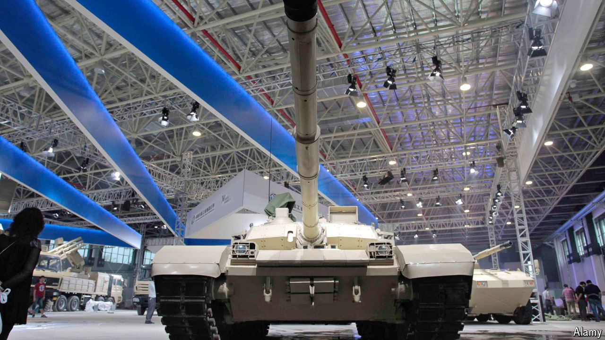

###### Arms for Africa

# Chinese weapons are taking over in Africa 

##### Sales are helped by low prices and a lack of scruples 

 

> May 23rd 2024 

When soldiers from China have made forays onto African battlefields, they have done so cautiously as UN peacekeepers. The sales teams that market their weapons overseas are far more gung-ho and have been fanning out across the region—armed with brochures and freebies—in search of new customers. 

They are signing deals with an increasingly diverse list of clients, from historic friends to would-be buddies, keen to be kitted out with Chinese weaponry. Among the weapons China has delivered are warships to Djibouti and Mauritania and drones to Nigeria and Congo, according to a database maintained by the Stockholm International Peace Research Institute (SIPRI), a think-tank. It found that no fewer than 21 countries in sub-Saharan Africa took major deliveries of Chinese arms between 2019 and 2023. Perhaps seven in ten African armies now field armoured vehicles that are, like so many other products, made in China, reckons Janes, a publishing company specialising in defence. 

