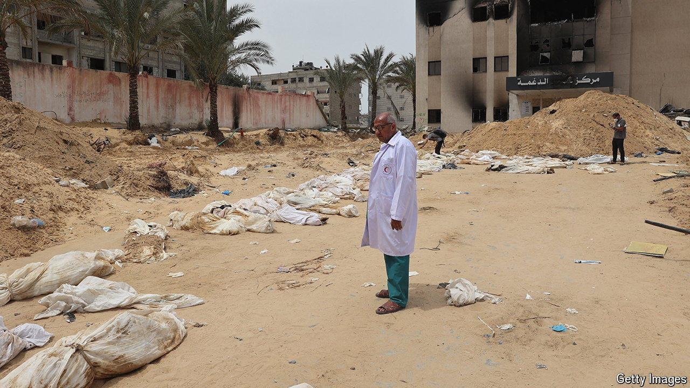

###### Deaths in Gaza

# How many people have died in Gaza? 

##### The fog of war may be thick, but some figures are solid 

 

> May 23rd 2024 

From the very start of Israel’s war against Hamas, the death toll in Gaza has been disputed. On May 8th the controversy over the numbers, which media organisations including  use, intensified after the un appeared to revise down its death toll for women and children. The un switched from using the overall figures provided by the Gaza Ministry of Health (moh)—which is controlled by Hamas—to using a count that included only people who had been identified. Some saw this as proof that the moh death toll is bogus. In reality the count has inevitably become less reliable as the war has dragged on. The list of identifiable dead is legitimate and marks the lower estimate for the lives lost in the war—about 25,000 at the very least, of whom around 14,000 are women, children or old people.

At the war’s start the moh death toll was probably fairly accurate. At this time, the numbers were based solely on deaths registered at hospitals and morgues. In past Gaza conflicts, the figures produced by moh matched those independently calculated by both the un and Israel.

