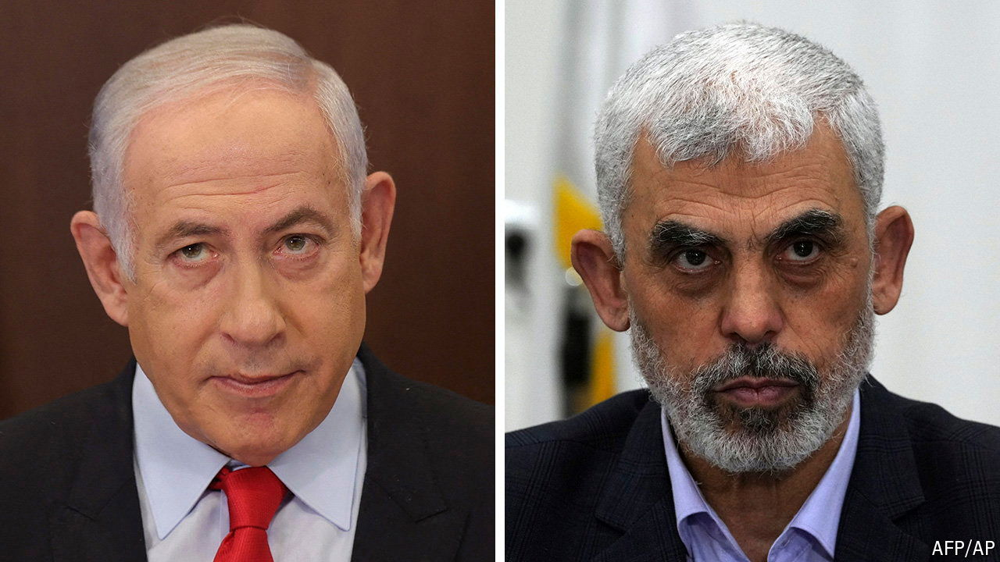

###### Israel and Hamas in the dock

# The ICC’s threat to arrest Binyamin Netanyahu has shocked Israel 

##### America and Israel have reacted with outrage at the implied equivalence between Israel and Hamas 

 

> May 20th 2024 

IT HAD BEEN been expected in Israel for weeks, but was still a shock when it came. On May 20th the prosecutor for the International Criminal Court (ICC), Karim Khan, announced that he was requesting arrest warrants for Binyamin Netanyahu and Yoav Gallant, Israel’s prime minister and defence minister, as well as the leaders of Hamas, the Islamists who launched the deadly attack on Israel on October 7th last year, on charges of war crimes. 

The prospect of their leaders appearing in the dock along with the perpetrators of a massacre against them is unthinkable for Israelis. But it is a sign of the horror with which many have come to view their government’s devastating war in Gaza. Mr Khan, a British lawyer, issued detailed and lengthy accusations against both sides. He opened with the allegations against the Hamas chiefs, Yahya Sinwar (pictured right), Mohammed Deif and Ismail Haniyeh, detailing the murder, sexual assault and kidnapping of Israeli citizens. But the charges against the Israeli ministers were no less pointed. 

