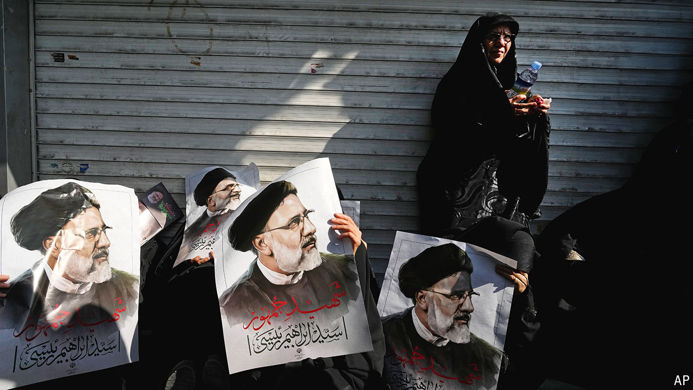

###### The battle for control of Iran

# The death of the president changes the power dynamic in Iran 

##### The supreme leader’s son may be the beneficiary 

 

> May 21st 2024 

Had the supreme leader, Ayatollah Ali Khamenei, looked a touch less steely when delivering his eulogy, more Iranians might have believed the  was just an accident. Even Mr Khamenei’s officials contrasted his perfunctory manner towards the deaths of Ebrahim Raisi and Hossein Amir-Abdollahian, Iran’s foreign minister, in a helicopter crash on May 19th with the supreme leader’s uncontrollable sobbing after the assassination of his top commander, , four years ago. 

The rescue efforts compounded Iranians’ suspicions. First responders in the Red Crescent were stunned that rescue workers had to proceed on foot. Nor could they believe the delays they faced reaching the site. Strange, too, thought many in Iran, that the two helicopters escorting the president returned safely to Tabriz. The initial reports spoke of fog and “a hard landing”. But the helicopter, according to the rescue team, had exploded. Mr Raisi’s chief of staff, who was part of the convoy, claimed that the skies had been clear. 

