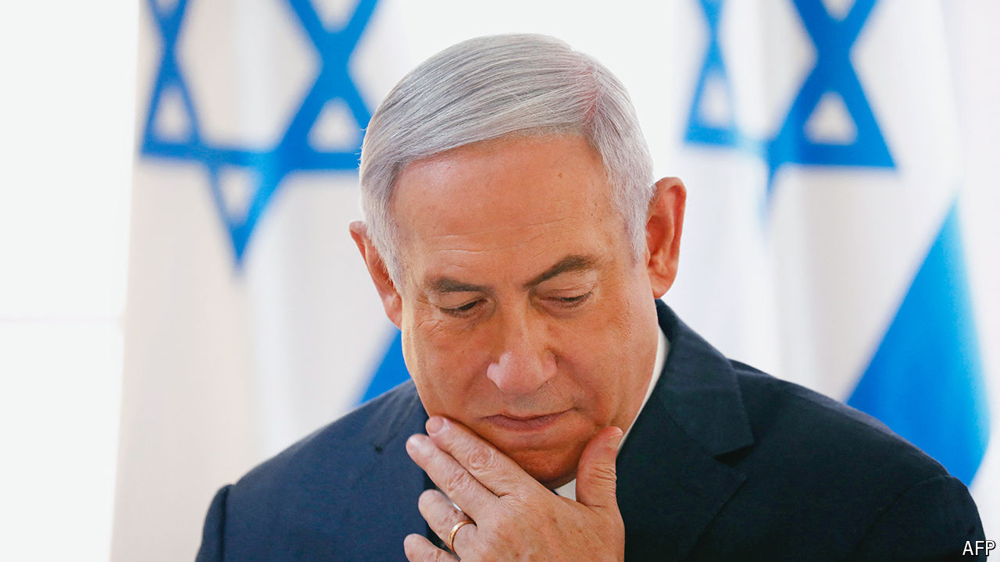

###### The Israel-Hamas war

# The revolt against Binyamin Netanyahu 

##### His war cabinet and generals want a new plan—and a new boss 

 

> May 19th 2024 

FOR MONTHS generals and ministers in  have been warning from behind the scenes that the government of , the prime minister, lacks a coherent strategy for the war in Gaza and its aftermath. Now at last these bitter arguments are breaking into the open. Israel’s war cabinet and security establishment are drawing ever closer to an open revolt against Mr Netanyahu, and are clear they want a sharp change of direction or new government. The shift comes as the prime minister faces the threat of an arrest warrant from the  (icc). Meanwhile Jake Sullivan, America’s national security adviser, landed in Israel on May 19th. He had just been in Saudi Arabia, where he was finalising a blockbuster security deal with the kingdom that includes proposals for remaking how Palestinians are ruled. 

The pivot against Mr Netanyahu began not with the politicians but with the Israel Defence Forces (IDF). In off-the-record briefings generals have accused him of blocking any day-after plans for Gaza and “squandering” Israel’s gains in the war. “It’s the prime minister’s job to set strategy,” says a general. “But when there is no strategy, it is the army’s job to warn of the dangers.” Because Mr Netanyahu has resisted the creation of an alternative force or authority to govern Gaza, there has been a vacuum which the remnants of Hamas have re-emerged to fill. 

