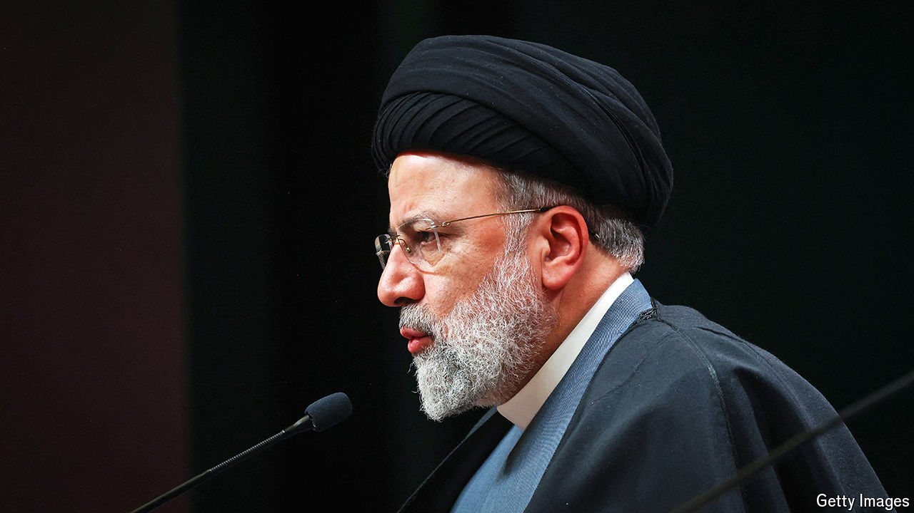

###### Morality and butchery

# Ebrahim Raisi was obsessed with the security of the people 

##### The hardline president of Iran died in a helicopter crash on May 19th, aged 63 

 

> May 22nd 2024 

As the helicopter rose through the misting clouds, Ebrahim Raisi stared sombrely out of the window. The view, of the rugged mountains of north-west Iran, should have been magnificent. Today, there was not so much to see. And in any case he was not given to smiling. It did not suit the black turban he wore, a token of his descent from the Prophet, or his usual black clerical robes, or his thin glasses. He preferred to appear as what he was, an unbending expert on sharia law, for whom chopping off the hands of thieves was “one of our greatest honours”.

Yet he had done an unusual amount of smiling that day, as he inaugurated, with President Ilham Aliyev of Azerbaijan, the giant Qiz Qalasi dam on the Aras river. It marked a rapprochement between their countries. They had had their ups and downs, but today he had called Mr Aliyev a brother and a friend. Their co-operation, he said, would make their enemies despair. 

