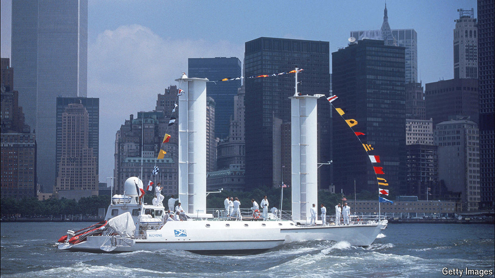

###### Easy breezy

# A new age of sail begins 

##### By harnessing wind power, high-tech sails can help cut marine pollution 

 

> May 21st 2024 

In 1926 an unusual vessel arrived in New York after crossing the Atlantic. This was a converted  renamed . Its two masts had been torn down and a pair of 15-metre-high revolving cylinders were mounted on its deck instead. Known as Flettner rotors, after Anton Flettner, their German inventor, the rotors worked like sails. Not only were they extremely efficient, allowing the vessel to consume less than half the fuel an oil-powered ship of a similar size would use, they also let the craft tack closer to an oncoming wind than its original canvas rigging allowed. The rotors were hailed as a great achievement at the time (praised by Albert Einstein, among others) before cheap oil caused interest to wane. 

More recently, the cost of oil has been rising—and not just financially. Ships, which transport more than 80% of the world’s goods, account for some 3% of humanity’s greenhouse-gas emissions, a similar fraction to aviation. Ports are, therefore, imposing emission limits on marine craft. The International Maritime Organisation has set targets to reduce emissions to net-zero by “around” 2050. The imprecision arises because at present there is no easy way of getting there. 

