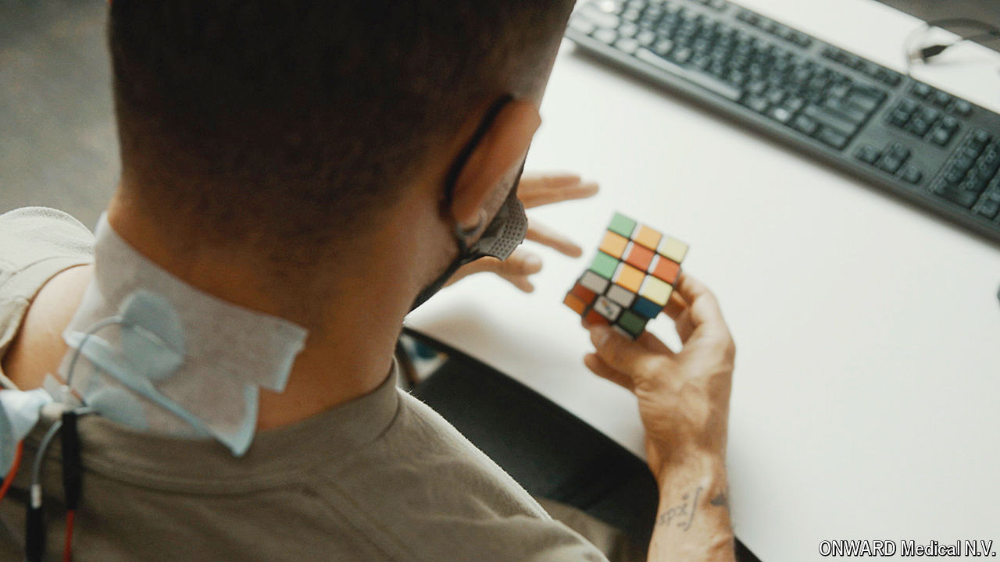

###### Charging ahead

# A promising non-invasive technique can help paralysed limbs move 

##### All that’s needed is electricity and exercise 

 

> May 20th 2024 

FOURTEEN YEARS ago, Melanie Reid, a journalist, fell off a horse and broke her neck. The injury to her spinal cord left her paralysed, limiting the function of her four limbs and torso—a condition known as tetraplegia. For years her left hand was incapable of either sensation or motion. Now, however, Ms Reid can not only move that hand; she can also, as she puts it, practise the “right to put my hair in a ponytail”.

Ms Reid’s remarkable—if incomplete—recovery required neither surgery nor medication, but, rather, exercise and electricity. She was one of 60 patients from test sites across three countries to receive a novel form of non-invasive spinal-cord stimulation, known as ARC, pioneered by Grégoire Courtine of the Ecole Polytechnique Fédérale de Lausanne and colleagues. The results of the trial were published in on May 20th.

